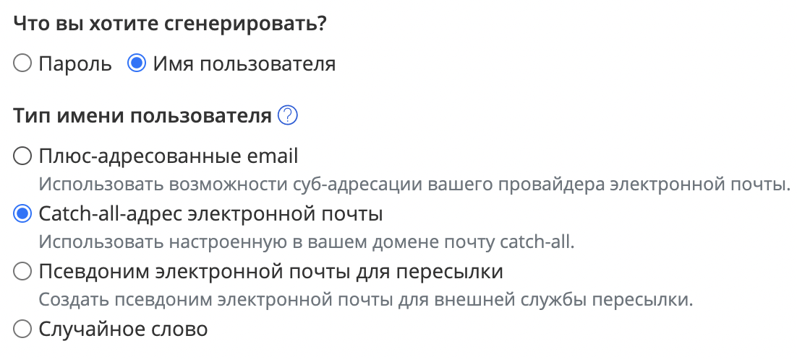

# Determining the source of a leak

## Finding yourself in leaks

Many sites allow you to search for yourself by phone number, email, or even full name in information leaks and leaked databases. They should be used with caution, because any online search may have an additional purpose of data enrichment. For example, **collecting your IP address**, or linking several searches by the same person to **collect information about their social circle**.

Therefore, the preferred option is always an *independent search in leak files*.

But this can be difficult: you need to find the file (or many files if you need an exhaustive search), understand its structure, and perform an effective search.

If you choose the simpler way, I recommend using the following resources, in descending order of risk:

#### Well-known safe sites

The most well-known is [Have I Been Pwned](https://haveibeenpwned.com/), maintained by a well-known security researcher and providing privacy guarantees.

Others:
- https://monitor.firefox.com/

#### Commercial alternatives

These often provide freemium access. You can find similar sites by searching for keywords like "check" or "leak":

- https://leakcheck.io/
- https://checkleaked.cc/

#### Bots in Telegram

~- https://t.me/PhoneLeaks_bot - search for leak sources~ - no longer works

Most bots do not indicate the source from which the information was obtained. A list of some resources:
[Google Spreadsheet](https://docs.google.com/spreadsheets/d/1XerMPGwaDz1FG1gBumBp6jzOgSqhWcQWgZmhxoT60WA/edit#gid=0).

#### Notifications

Some of the sites listed above also provide notification by email when a new leak containing your data is detected. If you lead an active online life, this type of service is highly recommended.

## Using aliases/fake email addresses

Gmail and other major email services support special characters for creating aliases of your mailbox. Mail sent to an alias will arrive at your primary address, but you will clearly see the alias it was sent to in the "Recipient" field.

For example, `soxoj@protonmail.com` is equivalent to `soxoj+gitlab@protonmail.com`:


It is **strictly recommended** to use this feature on all sites where it is supported.
Thus:
1. In case of leaks or spam, you will know exactly which service the leak originated from.
2. In case of targeted information gathering using your email, information from multiple sites will be less likely to be merged into a single dossier.

Of course, leak harvesting often involves email normalization: removing alias parts and cleaning up extras. Therefore, this only reduces the risk rather than providing complete protection.

Special mention should be made of providing email addresses **for receiving receipts** for online purchases.
```
According to paragraph 2 of Article 1.2 of Russian Federal Law No. 54-FZ, the receipt must be sent
electronically if the buyer has provided their phone number or email address before the payment.
```

This is exploited by major Telegram bots such as Eye of God ("Глаз Бога"): they store all your payment information and **add the specified email** to the data the bot provides.

Therefore, if you do not need a receipt, provide a deliberately incorrect email address that points to the source of the leak, e.g., eyeofgod@receipt.com. Alternatively, use the aliases mentioned above, which explicitly reveal where the address was registered.

## Using different names for tracking

Besides directly searching for yourself in databases, you can proactively leave "beacons" that will help you quickly identify the site or company responsible for a leak. Most commonly in everyday life, this happens with spam calls that mention your name — for example, a name you provided on a classifieds website.

Websites have different approaches to the accuracy of account names. Some require that they match passport data ([e.g., VKontakte](https://roem.ru/21-06-2009/126784/v-v-kontakte-mojno-smenit-imya-lish-na-nastoyashchee/)), some only verify them for financial transactions, and most do not validate at all.

You can use the tricks listed below depending on the strictness of the service rules (ToS, Terms of Service). But before using them, I strongly advise you to study what sanctions are possible if you provide an invalid name, and assess these risks for yourself.

#### Use names/surnames that are consonant with or begin with the same letters as the site/company name.
This way, if that name is leaked in conjunction with a phone number or email, you will know where the information came from:

- McDonald's: _Maxim_
- VKontakte: _Vova_
- Odnoklassniki: _Oleg_

#### Use variations of the name in Cyrillic or Latin
First of all, this applies to the full/abbreviated form of the name:

- Alexander
- Sasha
- Sanya
- Shura

Due to differences between languages, a name can have several transliterated forms.
Even banks often provide the option of choosing the correct transliteration of names.
For example, the name "Anatoly" can be represented as:

- Anatoly
- Anatolii
- Anatoliy

---

<details>
  <summary>🥷 Advanced level</summary>
  </br>

### Using Bitwarden to generate email aliases

The Bitwarden password manager allows you to generate random email aliases with a plus sign, as well as catch-all mailbox addresses and forwarding mailboxes.

Read more about these features in the "🥷 Advanced level" section of the [Email](./email.md) page.



</details>

---

[⬅️ Back](./breaches.md) | [⏫ Table of contents](../README.md) | [➡️ Next](./canary-tokens.md)
