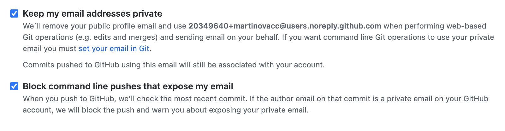

# Privacy for developers

## Exposing your email address

When working with program code and version control systems such as git, there is a risk of exposing
your personal email address. This often happens when working with personal/work projects
on the same device at the same time.

To avoid this, check the correctness of global settings or settings in the directory of a specific repository:
```
git config --global user.name
git config --global user.email
```

GitHub provides the ability to hide your email from the interface and block the "leak" of the main email address linked to the account:



*This section will be updated*

---

[⬅️ Back](./instagram.md) | [⏫ Table of contents](../README.md) | [➡️ Next](./2fa.md)
