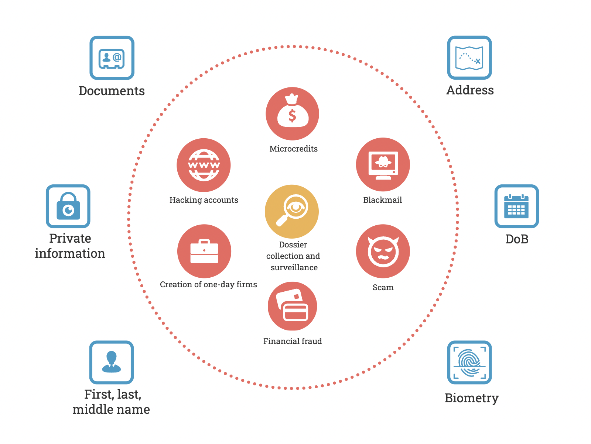

# Why it is important

It's hard to stay off the grid in these digital times. A hermit may have an emergency phone, and a dog, though not every dog, may have an Instagram account.

The pervasiveness of social media and communications could be highly positive if it didn't lead to many unfortunate consequences. For example, fake Sberbank employees calling to ask you to dictate your password from a text message to debt collectors suddenly demanding the return of a loan taken out on the information extracted from your passport.

In recent years, there has been a trend towards privacy and protection of user information: GDPR, CCPA, and LGBD. Companies have been obliged to secure personal data and prevent leaks. But are they collecting less information about us? No. Our data is a source of profit for them.

But the tightening of regulations is not enough for companies. You probably left a lot of "breadcrumbs" because you've been on the Internet for years: Old accounts, advertisements, public correspondence, and photos. These traces can be used to get close to you and exploit it for whatever purpose.

---

*Interesting fact: in 2017, a journalist [found the anonymous accounts of the FBI director](https://gizmodo.com/this-is-almost-certainly-james-comey-s-twitter-account-1793843641) in just a couple of hours. It was enough to get a tip about his existence, information about his son and about his thesis in theology.*

---

The enormous amount of data about people that can easily be collected by improvised means has led to the popularity of OSINT, a methodology for collecting and analysing data from open sources. The term is now often used to refer to "spying on people" or "deanonymisation" techniques, even though it was initially an intelligence methodology. Any tool can be used for good and bad - this is something to keep in mind.

It is, therefore, essential to have "**Counter-OSINT**" means and tools to protect your data and ensure your privacy.

## What will happen in the next sections

We will study simple but effective steps that will make it very difficult for an outsider observer to gather information about you.

The guide will be helpful to the broadest range of people interested - not just those who have heard something about OSINT but also friends, acquaintances and parents. An investment of half an hour for thoughtful reading and deliberate actions will bring peace of mind and protection against fraud, surveillance, harassment, and blackmail.

At the same time, let's not neglect convenience. Many guides concentrate on keeping ourselves as safe as possible (even if it's not justified). On the other hand, We will start from the need to maintain **a balance between privacy and convenience**, in which Internet use is not complicated.

---

Let me remind you that OSINT is about collecting information from open sources. Unfortunately, our most sensitive data as phone number databases, passport data, and so on, often end up on the Net.

In the Russian Federation, through "probing", you can get detailed information about the owner of a phone number, car, or flat from official state registers and databases. Unfortunately, many people are willing to grant access for money to something that should be carefully protected.

Let's face it: it is impossible to ensure complete anonymity and remove yourself from all registers, but it is possible to complicate the search process so much that an intruder cannot cling to some information about you.

Thus, the purpose of the manual is to teach you how to protect publicly available information and make it harder to find other information about you.

### Defining important information

To understand which data is more critical and what should be protected more, you need to know the current realities, adjusted for Runet. That is what we will look at next, and to be objective, we will adopt [Operations Security (OPSEC) measures](https://en.wikipedia.org/wiki/Operations_security).

The term OPSEC, like OSINT, comes from US intelligence. It refers to the process that "_identifies critical information to determine if friendly actions can be observed by enemy intelligence, determines if information obtained by adversaries could be interpreted to be useful to them, and then executes selected measures that eliminate or reduce adversary exploitation of friendly critical information_".

First, let's list all the **primary data** that reveals our identity in one way or another that *exists physically off the Internet*. 

- Surname, first name, patronymic
- Date of birth
- Passport details (series, number, etc.)
- Physical address
- Personal documents (driving licence, etc.)
- Biometric data
- Other personal information

There is not much data like that. But with at least some of it, a hostile actor could pretend to be you and deceive a third party. For example, he could send a message to someone you know asking them to wire you money urgently because of a problematic situation.

In doing so, fraudsters will not necessarily be interested in your identity. For example, they can buy a database containing hundreds of "fresh" passports to link passport details to [QIWI e-wallets](https://qiwi.com/) to increase withdrawal limits.

Any personal data can be exploited. For example, restoring access to social media accounts often requires answering a security question. Thus, knowing your mother's maiden name or your favourite musician will increase the chances that your profile will be hacked by a hostile actor.

---

*Interesting case study: [in 2012, there was a high-profile case](https://habr.com/ru/post/149179/) of hijacking 4 accounts of a person with only address, name and email. An elaborate access recovery chain - first using available data, then linking fake data - allowed one to first gain access to Amazon, Gmail, Apple, and Twitter, and later even remotely erase data from a person's devices.*

---

You may have been confused by the "biometric data" point, but alas, its exploitation has long been part of our lives. Face searches, which use the same technology as that used to unlock a personal phone through the front camera, and extensive databases from social media have long been widespread. When you leave your photos on the Web, you leave the opportunity to a hostile threat actor to find you.

### Analyzing threats

According to the OPSEC process, let's analyse who might be interested in such actions and how information about us might be exploited. In the diagram below, let's look at popular uses of primary data and try to draw conclusions. 

What can be done with our data?
You have probably noticed that most entries are related to **gaining money**. I think the financial motivation of the scammers is self-explanatory. The only issue to note is that money can be stolen from you and others. It is critical for us to not participate in a court case because we can be both a witness and an accused. 

The benefits of harvesting comprehensive information about you, including access to correspondence, are less certain. It can be domestic harassment, espionage, blackmail, and so on. In most cases, it is clearly a **personal harm and privacy violation**.

These threats are clear and explainable and, in many cases, regulated by law. There is no point in listing the articles related to financial loss. There are so many of them, and the collection of personal data is 137 of the Criminal Code. However, let's face it: it takes a severe reason to go and force the case yourself, and getting involved in such processes is stressful. So back to the position already voiced above: our goal is to keep our data safe and avoid threats.

---
Obviously, the knowledge of the primary data is not enough to carry out fraud schemes. Such schemes are usually based on social engineering and involve remote interaction via phone calls or messages. We implicitly assume that the perpetrators already have our **secondary data, virtual identifiers** - phone numbers, emails, and social network accounts details. Thus, obtaining information about this data carries just as high a threat.

Each type of personal data will be explained in more detail later on. In the meantime, the more data that falls into the wrong hands, the more serious the outcome can be. Hence the conclusion - the amounts of personal data about you need to be under control, not scattered where they shouldn't be, and their use needs to be monitored.

Let's talk about **digital hygiene**.

---

[⬅️ Back](./intro.md) | [⏫ Table of contents](../README.md) | [➡️ Next](./hygiene.md)

